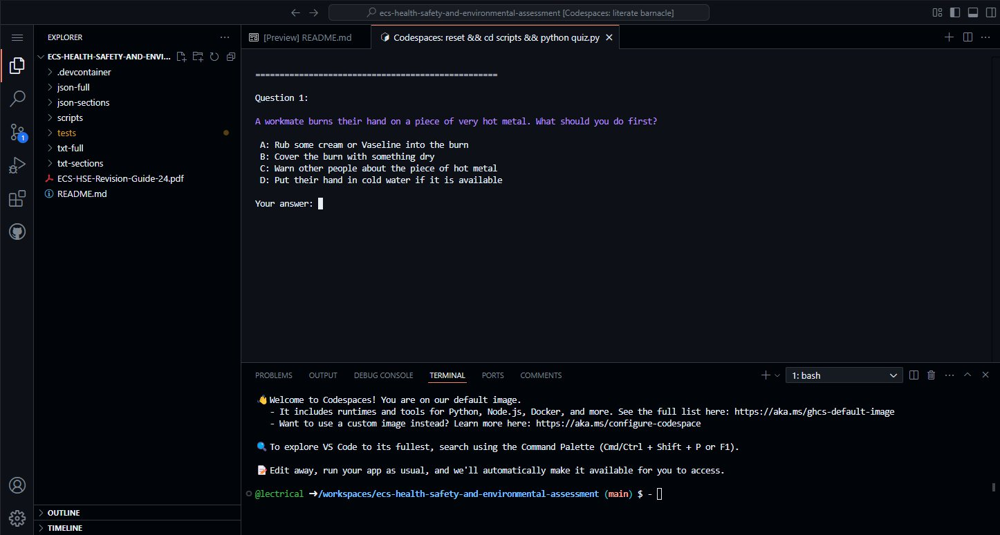

## Assessment info

For ECS Health, Safety and Environmental Assessments from 6 May 2024 - The assessment will be based on a 50 randomly selected questions from the bank of 327 revision questions.

The ECS HSE assessment comprises questions covering eleven topics. The numbers of questions randomly selected from each topic are:

| Topic                                             | Questions |
| ------------------------------------------------- | --------- |
| General Health and Safety at Work                 | 6         |
| Manual Handling Operations                        | 4         |
| Reporting Accidents                               | 3         |
| Personal Protective Equipment at Work             | 4         |
| Health and Hygiene                                | 3         |
| Fire and Emergency (inc Fire Safety in Buildings) | 9         |
| Work at Height                                    | 5         |
| Work Equipment                                    | 4         |
| Special Site Hazards                              | 3         |
| Electrotechnical                                  | 6         |
| Environmental                                     | 3         |

> [!TIP]
> You will not be asked a question that is not in the revision pdf when taking the test. If you know all the 327 questions and answers in the revision guide you will get 50/50

## What is this?

This is an open source revision tool for the official revision questions that have been extracted from the `ECS-HSE-Revision-Guide-24.pdf` and provided as plain text and `json` in this repo.

To dive right in just get revising, download the pre-built exe file and run it - [ECS_Quiz.exe](https://github.com/lectrical/ecs-health-safety-and-environmental-assessment/raw/refs/heads/main/ECS_Quiz.exe)

When you run it this is what you will see, your options:

```
Select quiz mode:

1. Full test (all 327 questions from main database question bank)
2. Generate new 50-question practice test in official ECS quiz format
3. Reuse existing practice test

Note on option 3: Question order is randomized each time but it's the same 50 questions.

Enter choice (1-3):
```

> [!NOTE]
> No data is collected nor is there any profiling or advertising. The binary should not even attempt any outgoing connections.
>
> Temporary data of the binary will be stored in `%LOCALAPPDATA%\Temp`

## Other ways to revise

A Socrative room for all 317 questions across all 11 sections. (no account required)

https://api.socrative.com/rc/gGX8Gp

> [!WARNING]
> It will not remember your progress if you close the session

> [!TIP]
> Import link for Socrative quiz: https://b.socrative.com/teacher/#import-quiz/79399500

via github codespaces (free github account required)

You can fork the repo and run a [preconfigured](.devcontainer/devcontainer.json) codespace that will generate a random 50 question quiz and launch it in the terminal.



via [quizgecko](https://quizgecko.com/) (free quizgecko account required)

ESC HSE Assessment sections.

- [section 01](https://quizgecko.com/learn/cdm-acronyms-quiz-v7odgk)
- [section 02](https://quizgecko.com/learn/safety-in-load-lifting-hazards-sjfylw)
- [section 03](https://quizgecko.com/learn/manual-handling-injury-protocol-n5udx2)
- [section 04](https://quizgecko.com/learn/dust-safety-quiz-dsim6j)
- [section 05](https://quizgecko.com/learn/asbestos-awareness-and-safety-regulations-kqvpcx)
- [section 06](https://quizgecko.com/learn/fire-safety-and-emergency-procedures-quiz-keivsw)
- [section 07](https://quizgecko.com/learn/construction-site-safety-quiz-b7ztwm)
- [section 08](https://quizgecko.com/learn/safety-guidelines-for-machinery-operation-w5gh36)
- [section 09](https://quizgecko.com/learn/confined-space-safety-permit-systems-p69sw7)
- [section 10](https://quizgecko.com/learn/electricity-at-work-regulations-quiz-510znd)
- [section 11](https://quizgecko.com/learn/hazardous-waste-disposal-procedures-oswtjt)

## Data sources

> [!NOTE]
> All this information is publicly available and free to use. Here are the source locations.

- Revision info : https://www.ecscard.org.uk/content/Preparation-and-Revision
- Revision guide pdf: https://www.ecscard.org.uk/getmedia/2bfce807-2289-4a51-a23e-b1c6f801f3e3/ECS-HSE-Revision-Guide-24-pdf.pdf

> [!TIP]
> This pdf is the basis of the information in this project. The information is freely available and you are supposed to revise it for the test.

## What do the scripts do?

> [!NOTE]
> Disclaimer: These scripts have been made with Copilot / Claude Sonnet 3.5 (preview)

`process_questions.py` will process all 327 questions across the 11 sections of the `txt-full/ECS-HSE-Revision-Guide-24.txt` that were taken from the `ECS-HSE-Revision-Guide-24.pdf`

This python script parses the txt into `json` in one of two ways.

- It creates a single `json` file with all sections in a single file in `json-full`
- It creates a `json` file per section in the `json-sections` directory

> [!NOTE]
> it defaults to `txt-full` and the source dir but can accept an input for the dir.

```bash
Usage: python process_questions.py <mode> [input_directory]
```

```bash
python process_questions.py full
python process_questions.py sections

python process_questions.py full txt-full
python process_questions.py sections txt-full
```

This just makes it easy to update the text file as and when the official revision guide is updated and the changes can easily be propagated to the json files.

`create-test.py` will generate a 50 question quiz with randomly selected questions from `json-full/ECS-HSE-Revision-Guide-24.json` in the same format as the official one. Every time it is runs it will create file `tests/ecs-test.json` overwriting the existing file.

`test_json_to_text.py` will convert `tests/ecs-test.json` to a human readable text file.

example Usage:

> [!WARNING]
> The script `quiz.py`requires `pip install colorama`

```bash
git clone https://github.com/lectrical/ecs-health-safety-and-environmental-assessment.git
cd ecs-health-safety-and-environmental-assessment
python quiz.py
```

`quiz.py` will run a quiz via terminal from the randomly generated `tests/ecs-test.json` quiz. A simple, free and effective way to mimic the exam.

`test_json_to_text.py` will convert the `tests/ecs-test.json` to a text file `tests/ecs-test.txt`. The check the `tests` directory for the outputs. You can feed the txt version to ai quiz generators and revision platforms like:

https://quizgecko.com/
https://www.remnote.com/

> [!WARNING]
> Binary security and privacy notes

The `ECS_Quiz.exe` is built using Github workflows and they can be seen here: https://github.com/lectrical/ecs-health-safety-and-environmental-assessment/actions

1: All binaries built use Github attestation [actions/attest-build-provenance](https://github.com/actions/attest-build-provenance) to show that the binaries in this repo were built via Github using this source code. This verifies the binary has not been tampered with and you get exactly what it says on the tin.

2: The binary is canned using Virus total during the build process. There are some false positives for it being created via PyInstaller but not from any of the serious vendors. The source code here is not malicious and build process is transparent.

3: The sha256 of the attestation and virustotal result will be the same.

```bash
gh attestation verify ECS_Quiz.exe -o lectrical
```

Will show something like

```
Loaded digest sha256:212d26db7e981ef2d08b948b300f94fc657d37ba9afbe1cfe07c05a96ee12014 for file://ECS_Quiz.exe
Loaded 1 attestation from GitHub API
✓ Verification succeeded!

sha256:212d26db7e981ef2d08b948b300f94fc657d37ba9afbe1cfe07c05a96ee12014 was attested by:
REPO                                                      PREDICATE_TYPE                  WORKFLOW
lectrical/ecs-health-safety-and-environmental-assessment  https://slsa.dev/provenance/v1  .github/workflows/binary.yml@refs/heads/main
```
