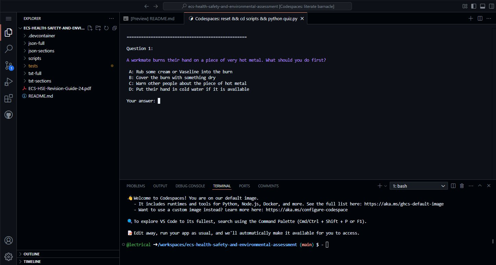

## Assessment info

For ECS Health, Safety and Environmental Assessments from 6 May 2024

- The ECS HSE assessment comprises of 50 questions selected across 11 topics. The numbers of questions randomly selected from each topic are:

| Topic                                             | Questions |
| ------------------------------------------------- | --------- |
| General Health and Safety at Work                 | 6         |
| Manual Handling Operations                        | 4         |
| Reporting Accidents                               | 3         |
| Personal Protective Equipment at Work             | 4         |
| Health and Hygiene                                | 3         |
| Fire and Emergency (inc Fire Safety in Buildings) | 9         |
| Work at Height                                    | 5         |
| Work Equipment                                    | 4         |
| Special Site Hazards                              | 3         |
| Electrotechnical                                  | 6         |
| Environmental                                     | 3         |

> [!TIP]
> You will not be asked a question that is not in the revision guide when taking the test. If you know all the 327 questions and answers in the revision guide you will get 50/50 on the test.

## Data sources

> [!NOTE]
> All this information is publicly available and free to use. Here are the source locations.

- Revision info : https://www.ecscard.org.uk/content/Preparation-and-Revision
- Revision guide pdf: https://www.ecscard.org.uk/getmedia/2bfce807-2289-4a51-a23e-b1c6f801f3e3/ECS-HSE-Revision-Guide-24-pdf.pdf

## What does this project do?

This project is a python based, open source revision tool to practice the official revision questions that have been extracted from the `ECS-HSE-Revision-Guide-24.pdf`, provided as plain [text](https://raw.githubusercontent.com/lectrical/ecs-health-safety-and-environmental-assessment/refs/heads/main/question-bank/full/txt/ECS-HSE-Revision-Guide-24.txt) and [json](https://raw.githubusercontent.com/lectrical/ecs-health-safety-and-environmental-assessment/refs/heads/main/question-bank/full/json/ECS-HSE-Revision-Guide-24.json) in this repo.

The python based utilities that power the project are in the [utilities](https://github.com/lectrical/ecs-health-safety-and-environmental-assessment/tree/main/utilities) directory.

The `ecs-quiz.exe` is a [pyinstaller](https://pyinstaller.org/en/stable/) bundle of the [quiz.py](https://github.com/lectrical/ecs-health-safety-and-environmental-assessment/blob/main/utilities/quiz.py) script that can be used independently of this repo with no privilege escalation or dependencies.

The project intends to serve to target audiences:

- Those who need to revise with no technical understanding requirement via the bundled exe file. This makes revision very accessible and consumable.
- Those with more developer and technical knowledge who can use the scripts directly or expand the project using the json files and quiz info.

### Get revising

Download the pre-built exe file and run it - [ecs-quiz.exe](https://github.com/lectrical/ecs-health-safety-and-environmental-assessment/releases/latest/download/ecs-quiz.exe)

When you run it this is what you will see, your options:

https://github.com/user-attachments/assets/26a6f631-48e3-4a49-8c7b-37245a6e247b

> [!NOTE]
> When run outside the repo environment the `ecs-quiz.exe` creates these files relative to the location of the exe when you run it.

- `ecs-practice-test.json` (if you select option 2 otherwise you don't see it)
- `quiz_progress.json` (as soon as you start a quiz. is deleted automatically when choosing to not resume or when a quiz is completed)

If run from inside the normal repo structure these files are saves in the `tests` folder.

> [!NOTE]
> No data is collected nor is there any profiling or advertising. The binary should not even attempt any outgoing connections.
>
> Temporary data of the binary will be stored in `%LOCALAPPDATA%\Temp\ME...` and is deleted when the binary is closed.

## Alternative ways to revise

Here are some other methods I created to revise this test (before this project was created)

A Socrative room for all 317 questions across all 11 sections. (no account required)

https://api.socrative.com/rc/gGX8Gp

> [!WARNING]
> It will not remember your progress if you close the session

> [!TIP]
> Import link for Socrative quiz: https://b.socrative.com/teacher/#import-quiz/79399500

via github codespaces (free github account required)

You can fork the repo and run a [preconfigured](.devcontainer/devcontainer.json) codespace that will generate a random 50 question quiz and launch it in the terminal.



via [quizgecko](https://quizgecko.com/) (free quizgecko account required)

ESC HSE Assessment sections.

- [section 01](https://quizgecko.com/learn/cdm-acronyms-quiz-v7odgk)
- [section 02](https://quizgecko.com/learn/safety-in-load-lifting-hazards-sjfylw)
- [section 03](https://quizgecko.com/learn/manual-handling-injury-protocol-n5udx2)
- [section 04](https://quizgecko.com/learn/dust-safety-quiz-dsim6j)
- [section 05](https://quizgecko.com/learn/asbestos-awareness-and-safety-regulations-kqvpcx)
- [section 06](https://quizgecko.com/learn/fire-safety-and-emergency-procedures-quiz-keivsw)
- [section 07](https://quizgecko.com/learn/construction-site-safety-quiz-b7ztwm)
- [section 08](https://quizgecko.com/learn/safety-guidelines-for-machinery-operation-w5gh36)
- [section 09](https://quizgecko.com/learn/confined-space-safety-permit-systems-p69sw7)
- [section 10](https://quizgecko.com/learn/electricity-at-work-regulations-quiz-510znd)
- [section 11](https://quizgecko.com/learn/hazardous-waste-disposal-procedures-oswtjt)

> [!TIP]
> This pdf is the basis of the information in this project. The information is freely available and you are supposed to revise it for the test.

## What do the scripts do?

> [!NOTE]
> Disclaimer: These scripts have been made with Copilot / Claude Sonnet 3.5 (preview) via prompting.

`process_questions.py` will process all 327 questions across the 11 sections of the `txt-full/ECS-HSE-Revision-Guide-24.txt` that were taken from the `ECS-HSE-Revision-Guide-24.pdf`

The `process_questions.py` python script parses the txt into `json` in one of two ways.

- It creates a single `json` file with all sections in a single file in `question-bank/full/json`
- It creates a `json` file per section 1 to 11 in the `question-bank/sections/json` directory

> [!NOTE]
> it defaults to `txt-full` and makes assumptions about the source dir but can accept an argument as an input for the source dir.

```bash
Usage: python process_questions.py <mode> [input_directory]
```

```bash
python process_questions.py full
python process_questions.py sections

python process_questions.py full ..\question-bank\full\txt
python process_questions.py sections ..\question-bank\full\txt
```

This just makes it easy to update the core question bank text file as and when the official revision guide is updated and the changes can easily be propagated to the json files.

> [!NOTE]
> quiz.py has the functionality of `create-test.py` built into it. `create-test.py` is for testing.

`create-test.py` will generate a 50 question quiz with randomly selected questions from `question-bank/full/ECS-HSE-Revision-Guide-24.json` in the same format as the official one. Every time it is runs it will create file `tests/ecs-practice-test.json` overwriting the existing file.

example Usage:

> [!WARNING]
> The script `quiz.py`requires `pip install colorama tqdm` - see the `requirements.txt`

```bash
git clone https://github.com/lectrical/ecs-health-safety-and-environmental-assessment.git
cd ecs-health-safety-and-environmental-assessment
pip install colorama tqdm
python quiz.py
```

`quiz.py` will run a quiz via terminal from the randomly generated `tests/ecs-practice-test.json` quiz. A simple, free and effective way to mimic the exam.

> [!TIP]
> The `ecs-quiz.exe` is built using the `quiz.py` so they have the exact same features.

`test_json_to_text.py` will convert the `tests/ecs-practice-test.json` to a text file `tests/ecs-practice-test.txt`. The check the `tests` directory for the outputs. You can feed the txt version to ai quiz generators and revision platforms like:

https://quizgecko.com/
https://www.remnote.com/

> [!WARNING]
> Binary security and privacy notes

The `ecs-quiz.exe` is built using Github workflows and they can be seen here: https://github.com/lectrical/ecs-health-safety-and-environmental-assessment/actions

1: All binaries built use Github attestation [actions/attest-build-provenance](https://github.com/actions/attest-build-provenance) to show that the binaries in this repo were built via Github using this source code. This verifies the binary has not been tampered with and you get exactly what it says on the tin.

2: The binary is canned using Virus total during the build process. There are some false positives for it being created via PyInstaller but not from any of the serious vendors. The source code here is not malicious and build process is transparent.

3: The sha256 of the attestation and virustotal result will be the same.

```bash
gh attestation verify ecs-quiz.exe -o lectrical
```

Will show something like

```
Loaded digest sha256:212d26db7e981ef2d08b948b300f94fc657d37ba9afbe1cfe07c05a96ee12014 for file://ecs-quiz.exe
Loaded 1 attestation from GitHub API
✓ Verification succeeded!

sha256:212d26db7e981ef2d08b948b300f94fc657d37ba9afbe1cfe07c05a96ee12014 was attested by:
REPO                                                      PREDICATE_TYPE                  WORKFLOW
lectrical/ecs-health-safety-and-environmental-assessment  https://slsa.dev/provenance/v1  .github/workflows/binary.yml@refs/heads/main
```
